# FinTrac, your trusted finance web!

Fintrac is a finance page designed so that all users can manage their banking transactions with the required security.
It is emphasized on every aspect needed when bank movements come to ours minds, starting from a nice and friendly menu into complex report systems.
As a matter of fact, you do not need to worry about loosing all the sacred information, we implemented a database that will mantain all your information secure at everywhere and at any time, so you can relax when it comes to be.
Here we can see a quick sneak peek of our database.
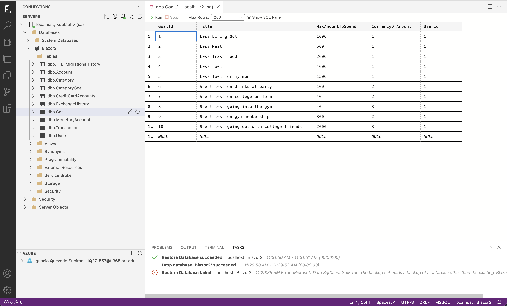

Our page works with a register/login indumentary,so to start with, you must create an account and then login!
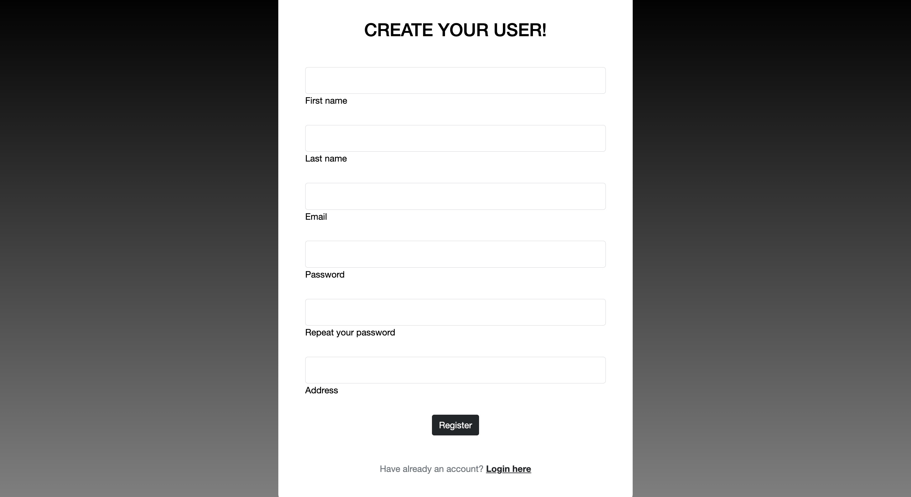
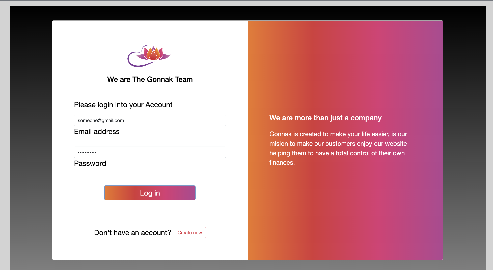

After you login you will jump into your personal space where you can catch up on your bank movements as:

1) Creating categories for your transactions.
2) Creating your bank accounts.
3) Creating goals to complete.
4) Creating Exchange histories for your different currencies.
5) Creating your transactions
6) Looking up different report statements, as your monthly spendings,account balance and much   more!

Below here you can see a short peak of every section mentioned above.

The Hub:
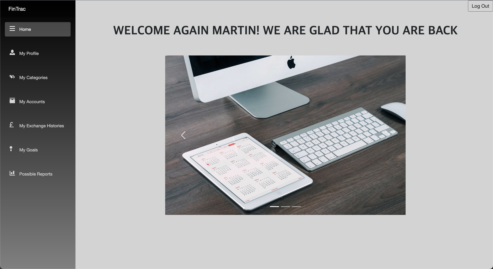

Your Profile:

Your Categories:
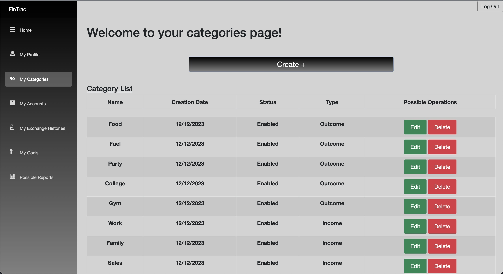

Your Bank Accounts:
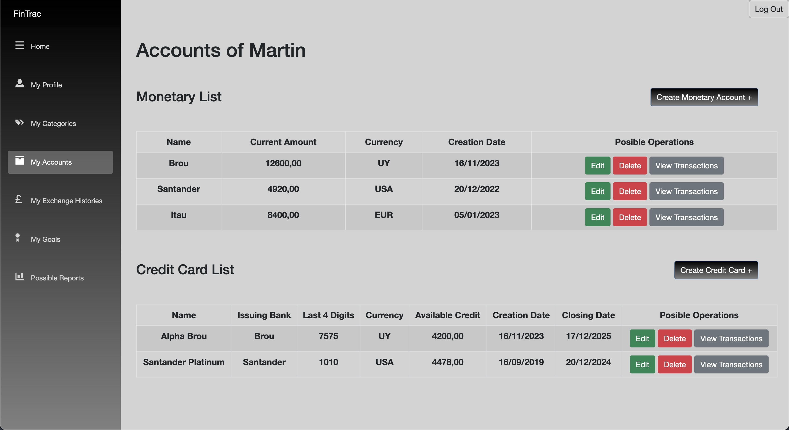

Your Transactions:
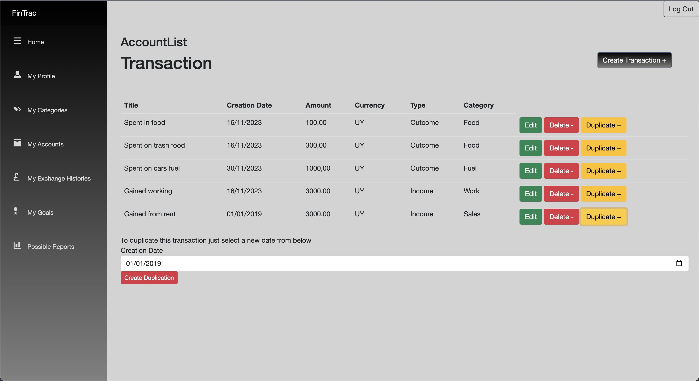

Your Exchange Histories:
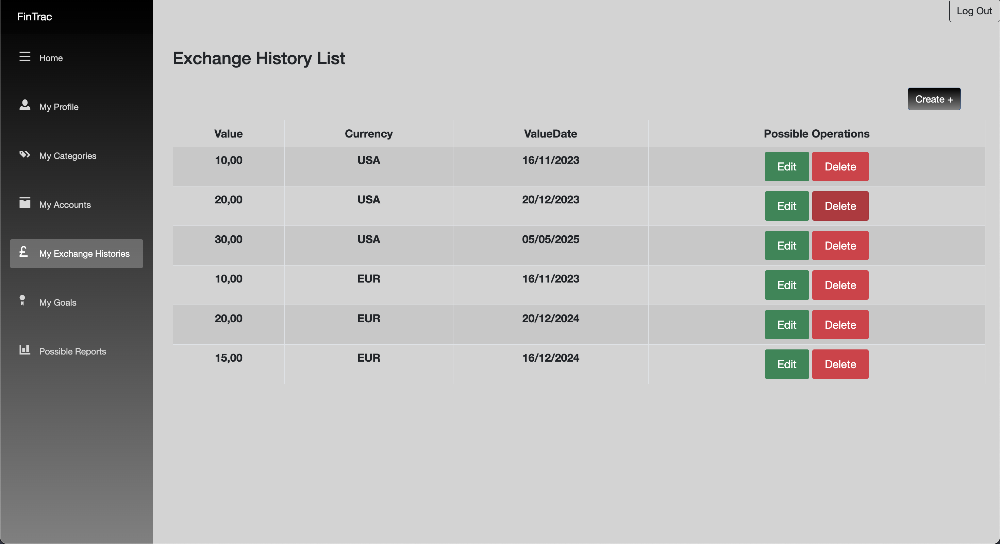

Your Goals:
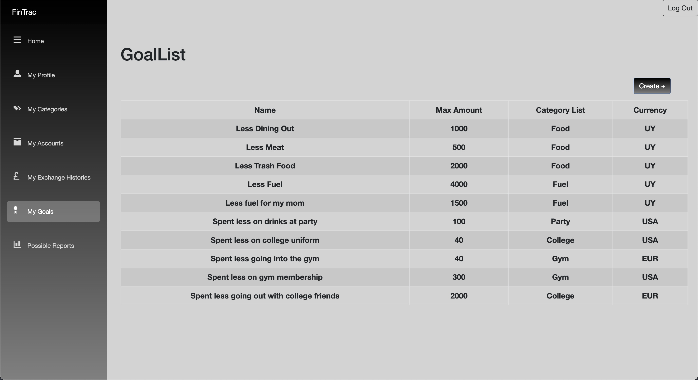

Your Reports:
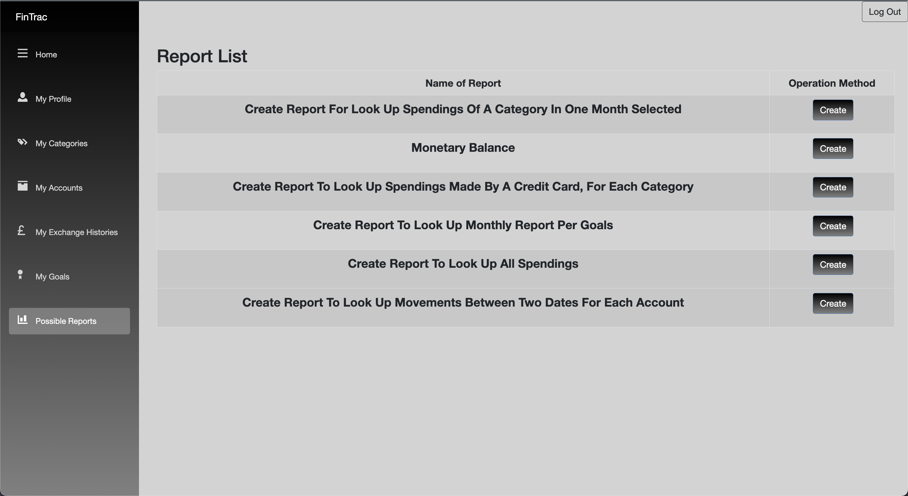

Every section has it own space for letting you create,modify and delete the respective aspects.
For example here we can see it via the category section.

Creation:
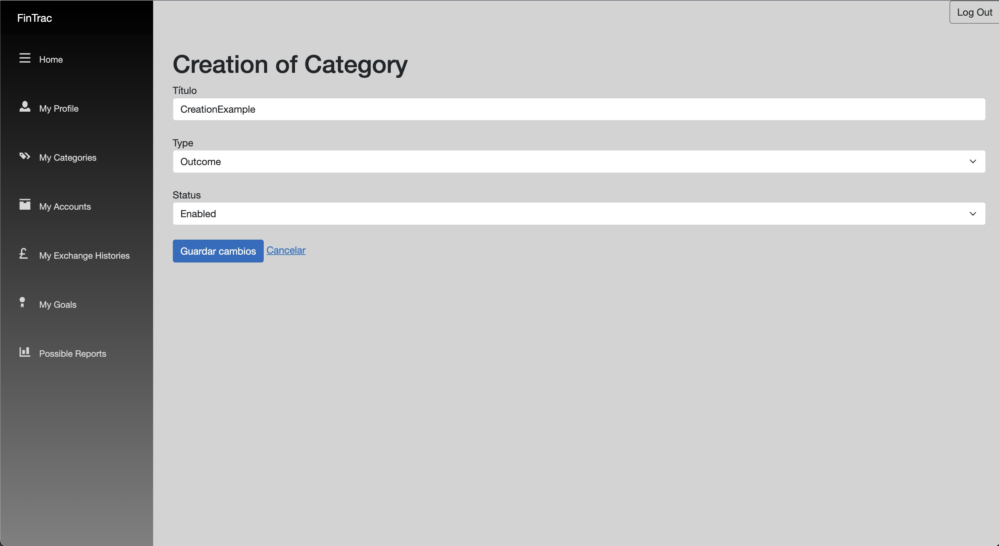

Edition:
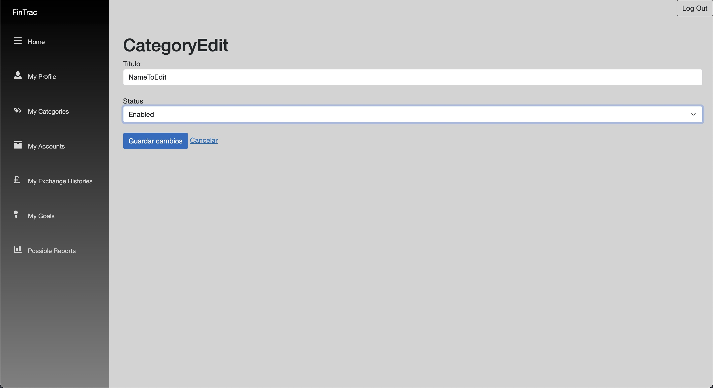

List:

Something that must be shown is that every aspect that you will produce on your personal space will be shown for a short time in a popup alert. So you can guarantee that everything is going as should be.
But, if something can not be done, it will unfold an error alert, telling you where the error is, aiming that with that information you will be able to fix the problem.

Here we can see an example:
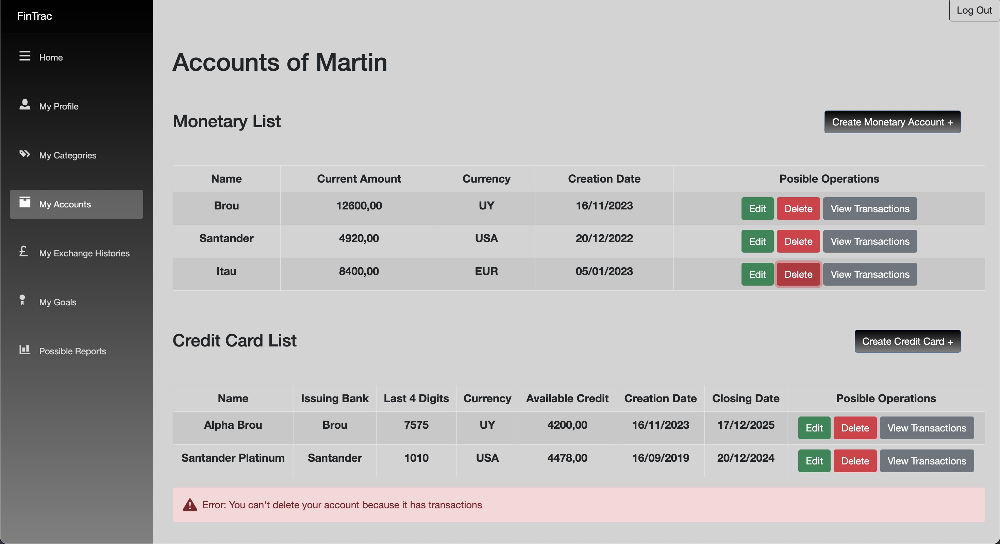

Last but not least, below this we can see the different report functionalities.

1) Report For Look Up Spendings Of A Category In One Month Selected.

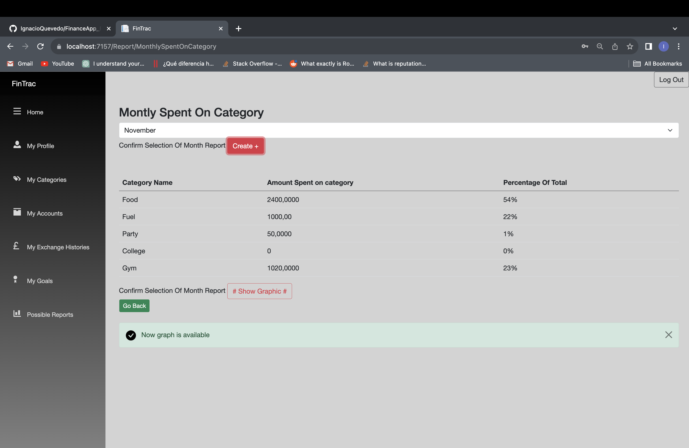

And also has a graph too look it better
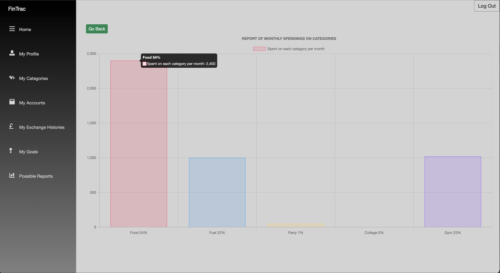

2) Monetary Balance.

3) Report for Look Up Spendings Made By A Credit Card, For Each Category.	

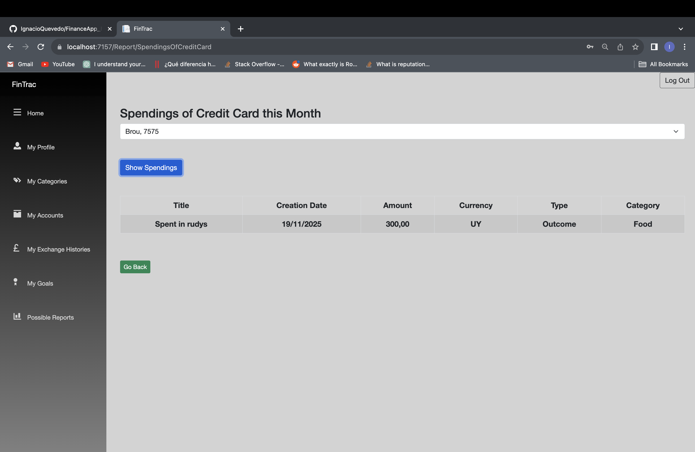

4) Report To Look Up Monthly Report Per Goals

5) Report To Look Up All Spendings.
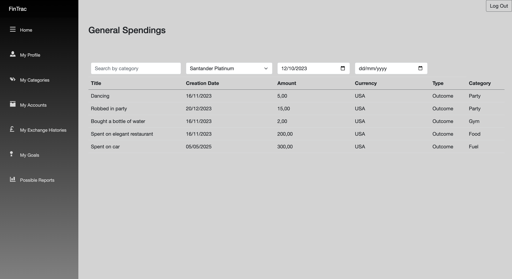

6) Report For Look Up Movements Between Two Dates For Each Account

And it also has a graph!
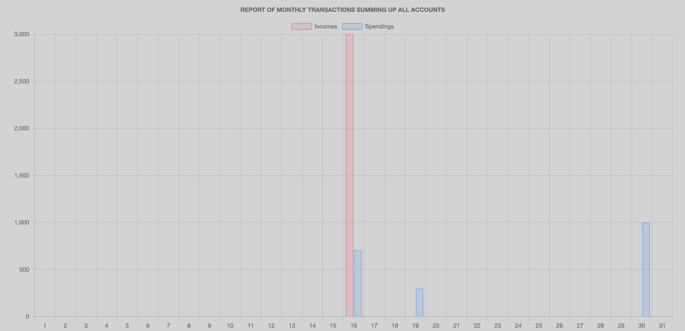